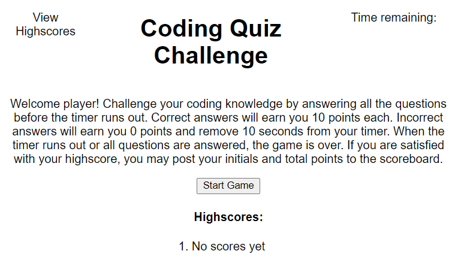

# Coding-Quiz-Challenge

The challenge for Week 4 was to create a quiz game that included a timer and highscore function connected to local storage. 

When building this project I was focused on functionality and trying out new things like JSON, jQuery, and ES6 shorthands of vanilla JavaScript. I read through a lot of documentation which introduced me to many new concepts. These concepts gave me ideas that I applied to my build. If I had more time outside of bootcamp study, I would revamp this website to make sure the highscores and initials input are displaying properly and completely functionial. I would consider adding a second HTML page for highscore display that is linked up to my index.html nav. This is a project I would like to come back to later once I am more comfortable with JavaScript. 

Link to the deployed application: 
[Coding-Quiz-Challenge](https://tdevans97.github.io/Coding-Quiz-Challenge/)
